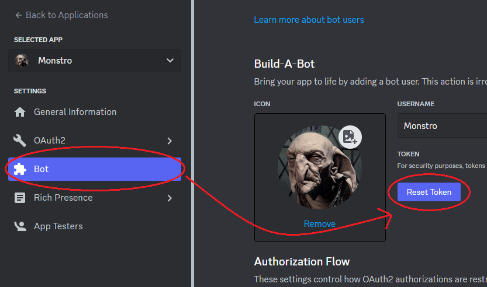
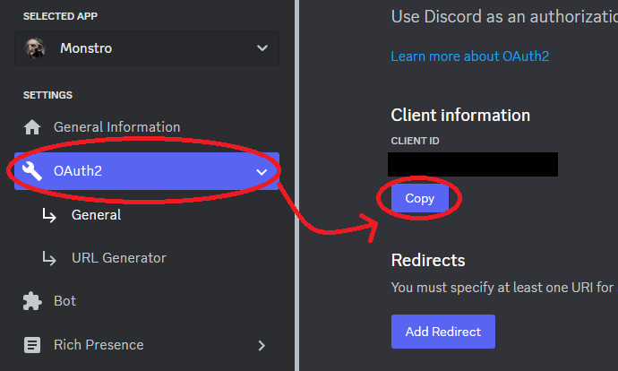
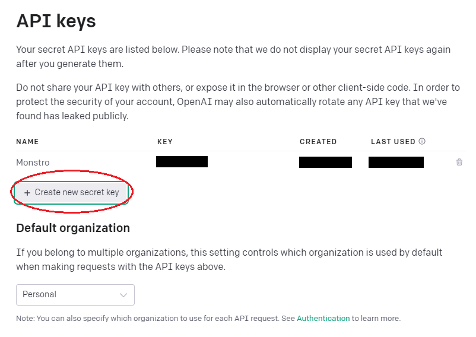

# Monstro é um bot discord que usa o modelo OpenAI `gpt-3.5-turbo`
<p align="center">
  
</p>

<p align="center">
  Monstro funciona apenas em servidores discord e não responde DMs
</p>

<p align="center">
  Ele te olha e julga
</p>

# Como instalar e fazer deploy:

### Crie um bot Discord:
```sh
https://discord.com/developers/applications
```
1. Gere o código de token no menu lateral `Bot`
<p align="center">
  
</p>

2. No menu lateral `OAuth2`, copie seu `CLIENT ID`

<p align="center">
  
</p>

### Use o `CLIENT_ID` para convidar o bot para seu servidor
```
https://discord.com/api/oauth2/authorize?client_id=<CLIENT_ID>&permissions=3072&scope=bot
```

### Crie uma API key no portal da OpenAI:
```sh
https://platform.openai.com/account/api-keys
```

<p align="center">
  
</p>

### Crie um arquivo `.env` copiando o arquivo existente `.env.sample`
```
cp .env.sample .env
```
- `BOT_TOKEN` - Token do bot Discord criado
- `OPENAI_API_KEY` - API key gerada no seu portal OpenAI
- `OWNER_NAME` - O Monstro serve apenas a um mestre, Insira seu nome de usuário discord (somente o nome, sem #)

### Rodar via docker:
```
docker-compose up -d
```

### Rodar via yarn:
1. Instale [nodejs 18 LTS](https://nodejs.org/en/download)
2. Instale yarn com o comando `npm install --global yarn`
3. Restaure as dependências com o comando `yarn install`
```
yarn start
```

### Se tudo der certo verá no console a mensagem:
```
Monstro está saudável!
```